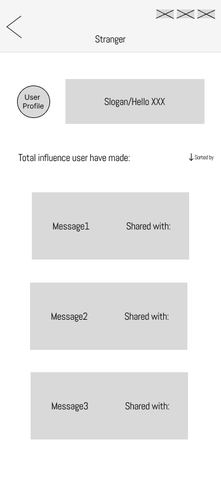

# User Experience Design

## App Map

## Wireframes

* Sign In Page

 

 

* Home Page

 

 

* New Message Page

 

 

* Message History
 

 

* Stats

 

* Profile
 

 

* Settings Page

 

- [app map & wireframe instructions](instructions-0a-app-map-wireframes.md).
- [prototype instructions](instructions-0b-prototyping.md)
