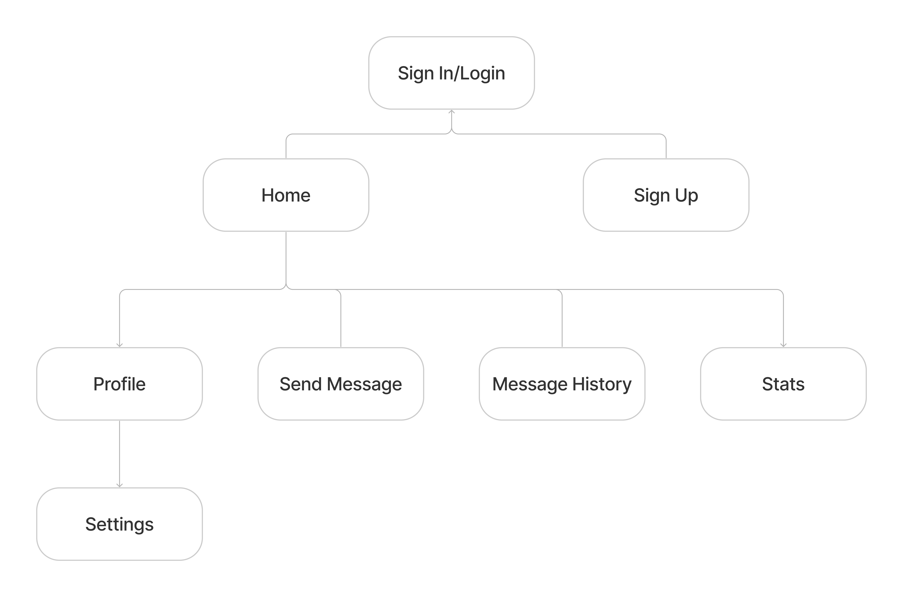
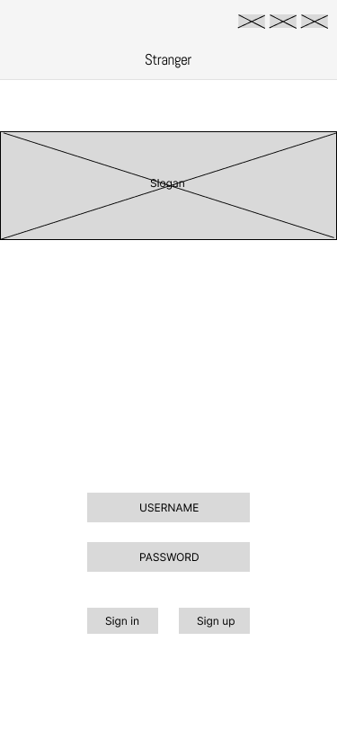
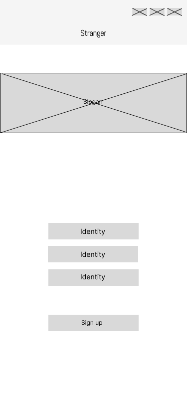
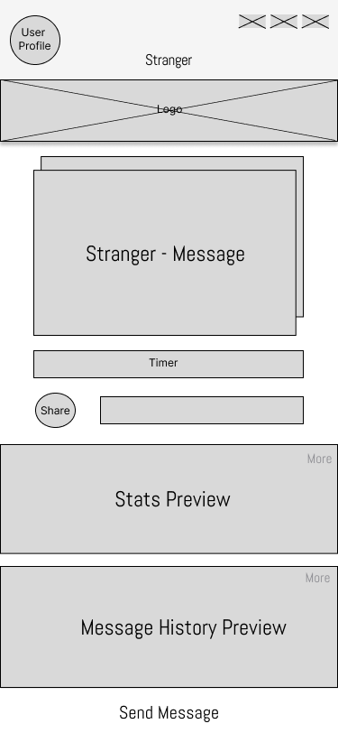
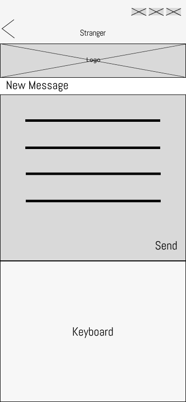
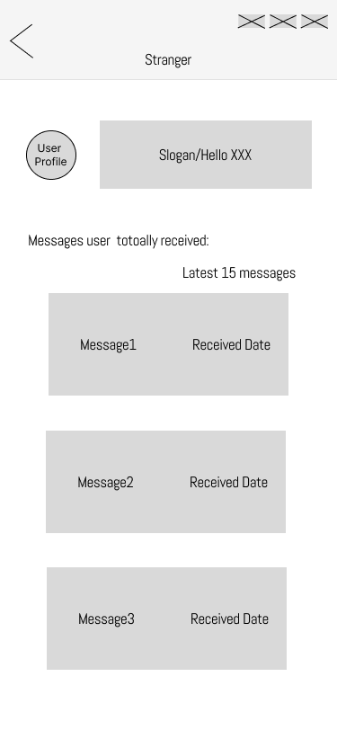
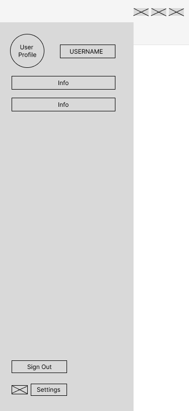
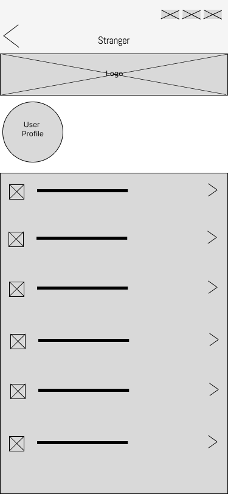

# User Experience Design

## Prototype

Please find our completed prototype at the following [Invision link.](https://invis.io/P2131ILEC7DU)

## App Map

Please find our App Map located below.

## Wireframes

We note the different pages of our wireframe below.

- Sign In Page

 

- Sign Up Page

- Home Page

 

- New Message Page

 

- Message History

 

- Stats

 

- Profile

 

- Settings Page

 
