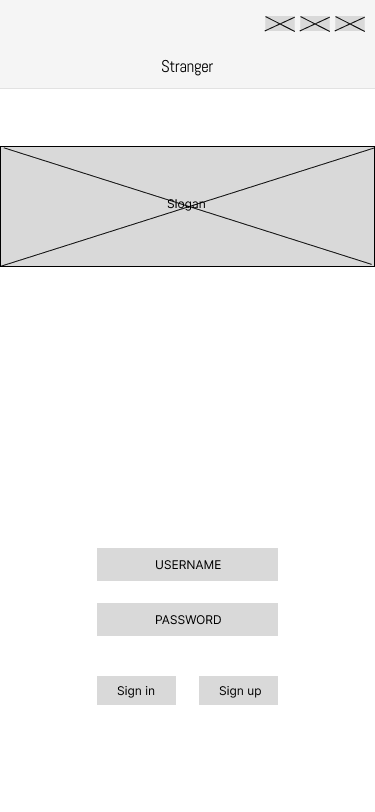
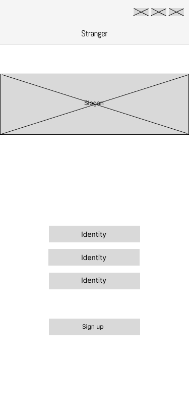
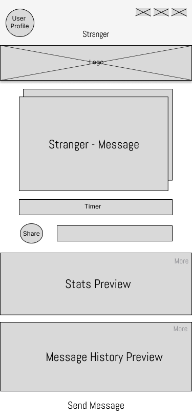
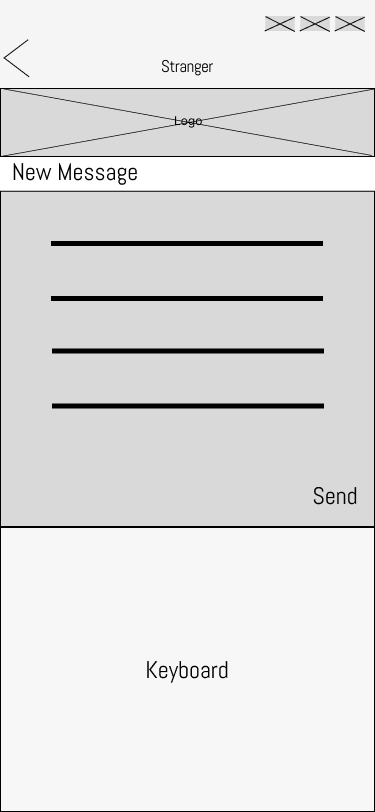
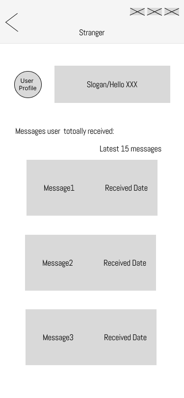
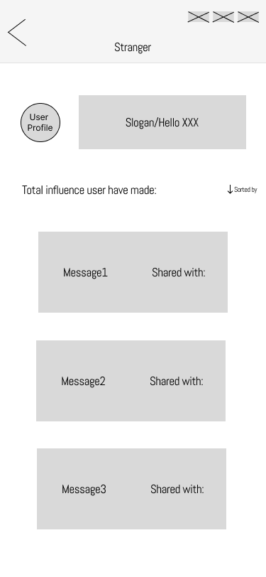
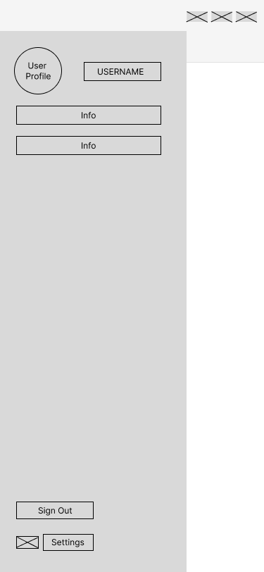
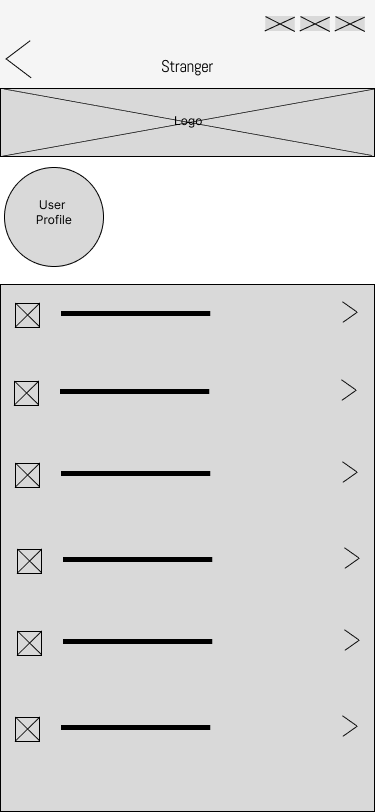

# Wireframes 

We note the different pages of our wireframe below.

- Sign In Page

 

- Sign Up Page

- Home Page

 

- New Message Page

 

- Message History

 

- Stats

 

- Profile

 

- Settings Page

 

- Sign-Up Page

 
